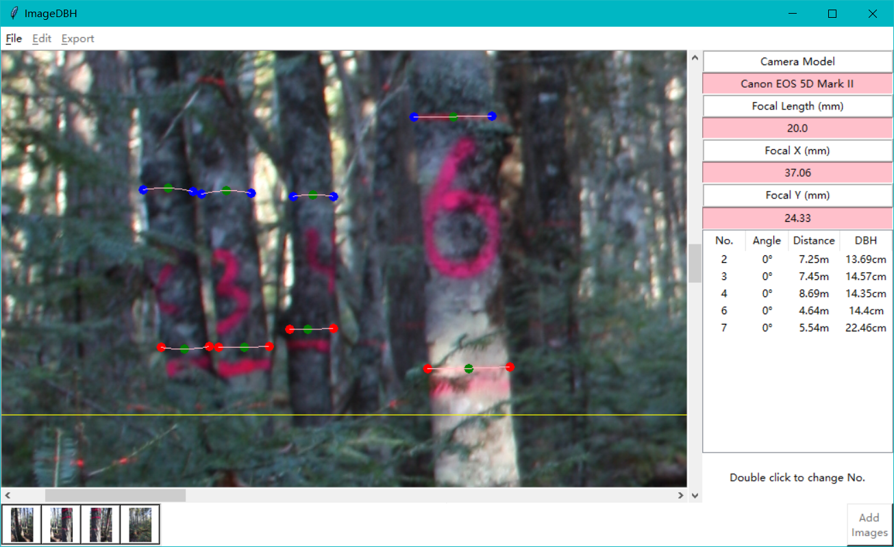
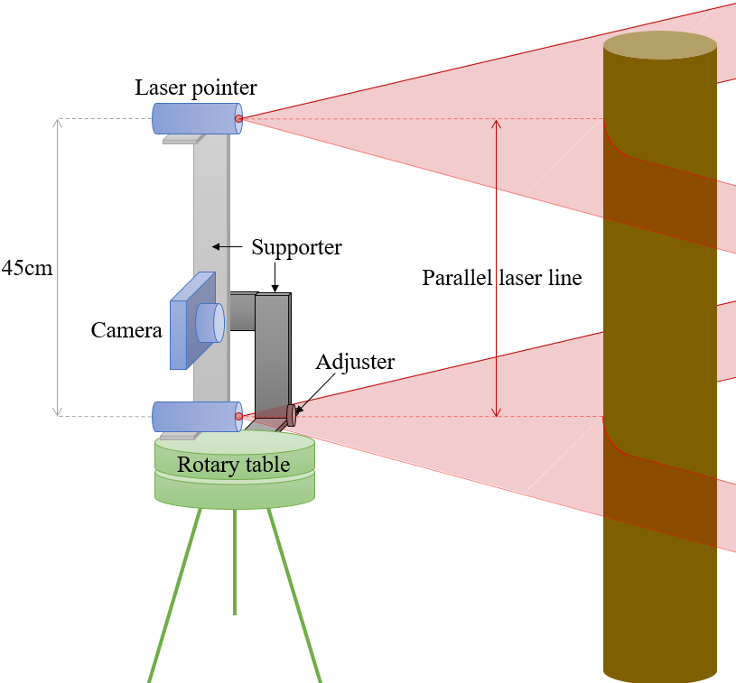
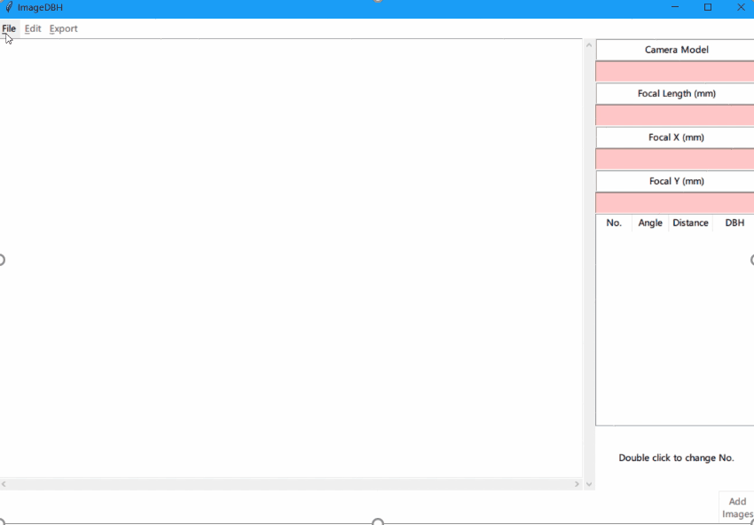
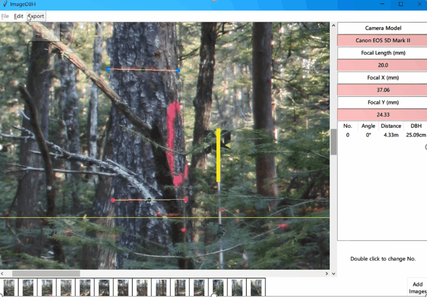

# ImageDBH
Extract and calculate DBH from photo images with referenced laser line.

## Instruments
all plot images were taken by the following instrument:

## main functions
### load image

### add tree points

### export data

